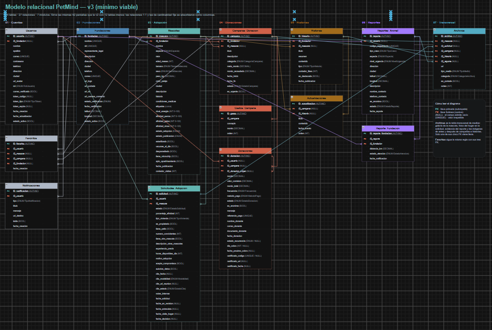

# PetMind Backend

Backend de PetMind, una plataforma para conectar personas, mascotas y fundaciones mediante procesos de adopción, campañas de donación, reportes de animales y contenido informativo.

Este segundo entregable incorpora el modelo de datos v3 y las capas `Repository`, `Service` y `Controller` construidas con Spring Boot.

## Equipo y responsabilidades

| Integrante | Responsabilidad principal |
|---|---|
| Santiago Varela | Servicios, modelo de adopción e historias, configuración de conexión y documentación técnica. |
| Brayan Ciro | Repositorios, servicios y controladores de usuarios, fundaciones, archivos, favoritos y notificaciones. |
| Emmanuel Gómez | Diseño del modelo de datos, diagramas, entidades complementarias, enums y embeddables. |

## Tecnologías

| Tecnología | Uso |
|---|---|
| Java 21 | Lenguaje principal |
| Spring Boot y Spring Web MVC | API REST y controladores HTTP |
| Spring Data JPA | Persistencia y repositorios |
| Bean Validation | Validación de datos |
| PostgreSQL y Neon | Base de datos y alojamiento |
| Maven | Dependencias y compilación |
| Lombok | Reducción de código repetitivo |
| Postman | Pruebas de endpoints |
| Git y GitHub | Control de versiones |

## Arquitectura

```text
Controller → Service → Repository → Entity → PostgreSQL
```

- **Controller:** recibe solicitudes HTTP y responde mediante `ResponseEntity`.
- **Service:** contiene reglas de negocio, validaciones y borrado lógico.
- **Repository:** accede a los datos mediante `JpaRepository`.
- **Entity:** representa las tablas y relaciones del modelo.
- **BaseEntity:** centraliza `id`, fechas de creación y actualización, y `estadoActivo`.

## Modelo de datos v3



El modelo v3 contiene 14 entidades. Se eliminó el módulo de cursos del modelo anterior porque no estaba contemplado en las pantallas de la aplicación. En su lugar se incluyeron fundaciones, campañas, reportes, historias, actualizaciones y archivos.

| Entidad | Tabla | Propósito |
|---|---|---|
| Usuario | `usuarios` | Adoptantes, administradores y representantes de fundaciones. |
| Fundacion | `fundaciones` | Información institucional y verificación de fundaciones. |
| Mascota | `mascotas` | Perfil de mascotas, características y estado de adopción. |
| SolicitudAdopcion | `solicitudes_adopcion` | Solicitudes, datos del hogar, entrevistas y decisiones. |
| CampanaDonacion | `campanas_donacion` | Campañas vinculadas a fundaciones y mascotas. |
| Donacion | `donaciones` | Donaciones únicas o recurrentes. |
| GastoCampana | `gastos_campana` | Gastos asociados a campañas. |
| Historia | `historias` | Historias de rescate, recuperación y adopción. |
| Actualizacion | `actualizaciones` | Novedades de campañas o historias. |
| ReporteAnimal | `reportes_animal` | Reportes de animales en abandono, maltrato o emergencia. |
| ReporteFundacion | `reporte_fundacion` | Asignación de reportes a fundaciones. |
| Archivo | `archivos` | Imágenes, videos y documentos del sistema. |
| Favorito | `favoritos` | Mascotas, campañas o fundaciones favoritas de un usuario. |
| Notificacion | `notificaciones` | Avisos de adopción, donación, campañas y sistema. |

### Enums y embeddables

El proyecto usa enums como `RolUsuario`, `EstadoAdopcion`, `EstadoPublicacion`, `EstadoSolicitud`, `EstadoCampana`, `EstadoDonacion`, `EstadoReporte`, `EstadoAtencion`, `CategoriaCampana`, `TipoHistoria` y `TipoNotificacion`.

Para agrupar campos relacionados se usan los embeddables `Direccion`, `InformacionContacto`, `CualidadesFisicas`, `Afinidad`, `DatosHogar` y `Cita`.

## Decisiones de diseño

### Relaciones unidireccionales

Las relaciones se modelan principalmente con `@ManyToOne(fetch = FetchType.LAZY)`. Se evitan `@OneToMany` y `@ManyToMany` para prevenir ciclos de serialización JSON al devolver entidades directamente.

### Sin DTOs

Para este entregable se exponen entidades directamente desde los controladores. Esta decisión reduce el alcance del proyecto académico; en un entorno productivo sería recomendable utilizar DTOs para controlar los datos de entrada y salida.

### Borrado lógico

Todas las entidades heredan de `BaseEntity` y usan `estadoActivo`. Al eliminar un registro no se borra físicamente: se cambia su estado a `false`. Las consultas de listado usan métodos con `EstadoActivoTrue`, por lo que no muestran registros inactivos.

### Validaciones en servicios

Las reglas de negocio se implementan en la capa de servicios. Algunos ejemplos son:

- El correo de usuario es obligatorio y único.
- Un representante debe pertenecer a una fundación verificada.
- Un favorito debe apuntar a una sola mascota, campaña o fundación.
- Un archivo debe pertenecer a un único recurso.
- Una mascota debe estar disponible antes de recibir una solicitud.
- Una campaña debe tener una fundación activa y una meta de recaudo válida.
- Una donación debe tener un monto mayor que cero y un método de pago válido.

### Carga perezosa

Las relaciones usan `FetchType.LAZY`. Para este entregable se mantiene el comportamiento predeterminado de Spring JPA con `open-in-view`, una decisión consciente para facilitar la serialización de entidades relacionadas.

## Repositorios

Cada entidad tiene un repositorio que extiende:

```java
JpaRepository<Entidad, Long>
```

| Repositorio | Consulta | Propósito |
|---|---|---|
| Todos | `findByEstadoActivoTrue()` | Lista registros activos. |
| UsuarioRepository | `existsByContactoEmailContacto(...)` | Verifica correo único. |
| MascotaRepository | `findByEstadoPublicacionAndEstadoAdopcionAndEstadoActivoTrue(...)` | Filtra mascotas por estado. |
| MascotaRepository | `findByEspecieAndCiudadIgnoreCaseAndEstadoActivoTrue(...)` | Busca por especie y ciudad. |
| SolicitudAdopcionRepository | `findByMascotaFundacionIdAndEstadoAndEstadoActivoTrue(...)` | Solicitudes por fundación y estado. |
| DonacionRepository | `findByUsuarioIdAndEstadoActivoTrueOrderByFechaDonacionDesc(...)` | Donaciones de un usuario. |
| DonacionRepository | `findByCampanaIdAndEstadoAndEstadoActivoTrue(...)` | Donaciones por campaña y estado. |
| ArchivoRepository | `findByMascotaIdAndEstadoActivoTrueOrderByOrdenAsc(...)` | Galería de una mascota. |
| NotificacionRepository | `findByUsuarioIdAndLeidaFalseAndEstadoActivoTrue(...)` | Notificaciones sin leer. |

## Endpoints disponibles

### Usuarios

| Método | Ruta | Descripción |
|---|---|---|
| GET | `/api/usuarios` | Lista usuarios activos. |
| GET | `/api/usuarios/{id}` | Consulta un usuario. |
| POST | `/api/usuarios` | Crea un usuario. |
| PUT | `/api/usuarios/{id}` | Actualiza un usuario. |
| DELETE | `/api/usuarios/{id}` | Realiza borrado lógico. |

### Fundaciones

| Método | Ruta | Descripción |
|---|---|---|
| GET | `/api/fundaciones` | Lista fundaciones activas. |
| GET | `/api/fundaciones/{id}` | Consulta una fundación. |
| POST | `/api/fundaciones` | Crea una fundación. |
| PUT | `/api/fundaciones/{id}` | Actualiza una fundación. |
| DELETE | `/api/fundaciones/{id}` | Realiza borrado lógico. |

### Mascotas

| Método | Ruta | Descripción |
|---|---|---|
| GET | `/api/mascotas` | Lista mascotas activas. |
| GET | `/api/mascotas/{id}` | Consulta una mascota. |
| GET | `/api/mascotas/por-estado?estadoPublicacion=PUBLICADA&estadoAdopcion=DISPONIBLE` | Filtra mascotas por estado. |
| GET | `/api/mascotas/buscar?especie=PERRO&ciudad=Medellin` | Busca por especie y ciudad. |
| GET | `/api/mascotas/por-fundacion?fundacionId=1` | Lista mascotas de una fundación. |
| POST | `/api/mascotas` | Crea una mascota. |
| PUT | `/api/mascotas/{id}` | Actualiza una mascota. |
| DELETE | `/api/mascotas/{id}` | Realiza borrado lógico. |

### Solicitudes de adopción

| Método | Ruta | Descripción |
|---|---|---|
| GET | `/api/solicitudes-adopcion` | Lista solicitudes activas. |
| GET | `/api/solicitudes-adopcion/{id}` | Consulta una solicitud. |
| GET | `/api/solicitudes-adopcion/por-usuario?usuarioId=1` | Solicitudes de un usuario. |
| GET | `/api/solicitudes-adopcion/por-fundacion?fundacionId=1&estado=PENDIENTE` | Solicitudes por fundación y estado. |
| POST | `/api/solicitudes-adopcion` | Crea una solicitud. |
| PUT | `/api/solicitudes-adopcion/{id}` | Actualiza una solicitud. |
| DELETE | `/api/solicitudes-adopcion/{id}` | Realiza borrado lógico. |

### Campañas de donación

| Método | Ruta | Descripción |
|---|---|---|
| GET | `/api/campanas-donacion` | Lista campañas activas. |
| GET | `/api/campanas-donacion/{id}` | Consulta una campaña. |
| GET | `/api/campanas-donacion/por-estado?estado=ACTIVA` | Filtra campañas por estado. |
| POST | `/api/campanas-donacion` | Crea una campaña. |
| PUT | `/api/campanas-donacion/{id}` | Actualiza una campaña. |
| DELETE | `/api/campanas-donacion/{id}` | Realiza borrado lógico. |

### Donaciones

| Método | Ruta | Descripción |
|---|---|---|
| GET | `/api/donaciones` | Lista donaciones activas. |
| GET | `/api/donaciones/{id}` | Consulta una donación. |
| GET | `/api/donaciones/por-usuario?usuarioId=1` | Donaciones de un usuario. |
| GET | `/api/donaciones/por-campana?campanaId=1&estado=COMPLETADA` | Donaciones por campaña y estado. |
| POST | `/api/donaciones` | Crea una donación. |
| PUT | `/api/donaciones/{id}` | Actualiza una donación. |
| DELETE | `/api/donaciones/{id}` | Realiza borrado lógico. |

### Favoritos

| Método | Ruta | Descripción |
|---|---|---|
| GET | `/api/favoritos` | Lista favoritos activos. |
| GET | `/api/favoritos/{id}` | Consulta un favorito. |
| GET | `/api/favoritos/por-usuario?usuarioId=1` | Favoritos de un usuario. |
| POST | `/api/favoritos` | Crea un favorito. |
| DELETE | `/api/favoritos/{id}` | Realiza borrado lógico. |

### Notificaciones

| Método | Ruta | Descripción |
|---|---|---|
| GET | `/api/notificaciones` | Lista notificaciones activas. |
| GET | `/api/notificaciones/{id}` | Consulta una notificación. |
| GET | `/api/notificaciones/no-leidas?usuarioId=1` | Lista notificaciones sin leer. |
| POST | `/api/notificaciones` | Crea una notificación. |
| PUT | `/api/notificaciones/{id}` | Actualiza una notificación. |
| PATCH | `/api/notificaciones/{id}/leida` | Marca una notificación como leída. |
| DELETE | `/api/notificaciones/{id}` | Realiza borrado lógico. |

### Archivos

| Método | Ruta | Descripción |
|---|---|---|
| GET | `/api/archivos` | Lista archivos activos. |
| GET | `/api/archivos/{id}` | Consulta un archivo. |
| GET | `/api/archivos/por-mascota?mascotaId=1` | Lista la galería de una mascota. |
| POST | `/api/archivos` | Crea un archivo. |
| PUT | `/api/archivos/{id}` | Actualiza un archivo. |
| DELETE | `/api/archivos/{id}` | Realiza borrado lógico. |

## Requisitos

- Java 21 o superior.
- Git.
- Acceso a una base de datos PostgreSQL en Neon.
- Maven Wrapper incluido en el proyecto.

## Configuración

Crea un archivo `.env` en la raíz del proyecto:

```properties
DB_URL=jdbc:postgresql://host-de-neon/nombre_base?sslmode=require
DB_USERNAME=tu_usuario
DB_PASSWORD=tu_contrasena
```

No subas este archivo al repositorio.

## Instalación y ejecución

```bash
git clone https://github.com/ciroescuderobrayan-SDJ/backend-pet-mind.git
cd backend-pet-mind
sh mvnw clean compile
sh mvnw spring-boot:run
```

El servidor inicia en `http://localhost:8080`.

## Pruebas con Postman

La colección disponible está en:

```text
docs/postman/PetMind-Brayan.postman_collection.json
```

1. Levanta la aplicación.
2. Importa la colección en Postman.
3. Ejecuta las peticiones de preparación.
4. Prueba usuarios, fundaciones, mascotas, solicitudes, campañas y donaciones.

## Flujo de trabajo en Git

1. Actualizar la rama principal.
2. Crear una rama por tarea.
3. Realizar commits descriptivos.
4. Ejecutar `sh mvnw clean compile` antes de subir cambios.
5. Subir la rama al repositorio personal.
6. Crear un Pull Request hacia el repositorio grupal.
7. Revisar y fusionar el Pull Request.

## Seguridad

- No subir `.env`.
- No compartir credenciales de Neon.
- No incluir contraseñas ni tokens en commits.
- La contraseña del usuario se recibe solo en solicitudes de entrada y no se devuelve en las respuestas.

---

Proyecto académico · PetMind · CESDE
